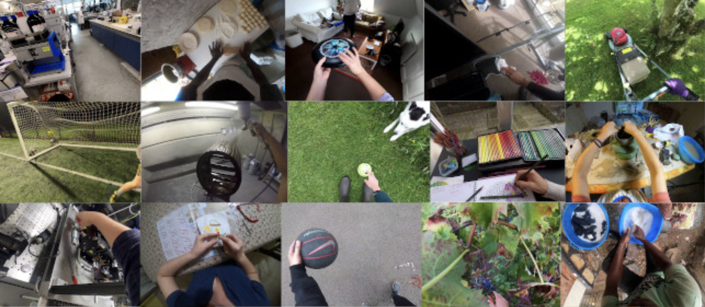
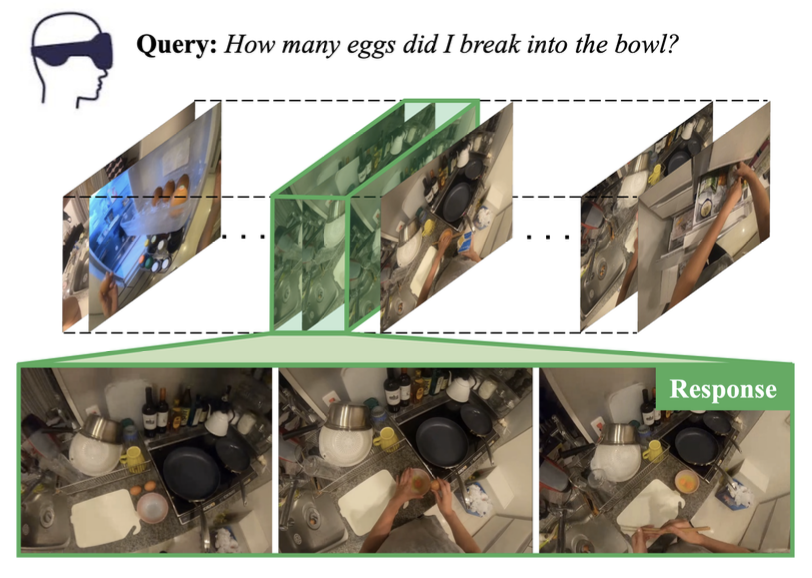

# Natural Language Queries in Egocentric Videos

## Table of Contents
- [Project Overview](#project-overview)
- [Methodology](#methodology)
    - [Dataset](#dataset)
- [References](#references)

## Project Overview

  
  

    <em>Figure 1: Frames of egocentric videos taken from the Ego4D dataset <a href="#references">[1]</a>.</em>
     
  

Egocentric Vision captures human interactions from a privileged viewpoint, thanks to cameras mounted directly on the head of the user performing the actions. The release of large-scale datasets, such as EPIC-KITCHENS [[2]](#References) and Ego4D [[1]](#References), has encouraged the research community to explore different opportunities for learning from egocentric videos, from the more traditional action recognition and anticipation tasks, to the use of natural language queries for video understanding.
A typical way for humans to understand what is happening in a video is to ask themselves questions under the form of natural language queries, like "Where was object <x> last seen?" or "Which objects did the user interact with?". Thus, the goal becomes to identify the segment of the video that allows the query to be answered. The use of natural language allows greater flexibility in the kinds of queries that can be made.

  
  

    <em>Figure 2: An example of a query on the content of the video, expressed in natural language.</em>
     
  

## Methodology
### Dataset :
**• Ego4D** [[1]](#References): 3,000+ hours of egocentric video data.

**• EPIC-KITCHENS** [[2]](#References): Annotated kitchen activity videos.

## References
[1] Grauman, Kristen, et al. "Ego4d: Around the world in 3,000 hours of egocentric video." Proceedings of the IEEE/CVF Conference on Computer Vision and Pattern Recognition. 2022.
[2] Damen, Dima, et al. "Rescaling egocentric vision: Collection, pipeline and challenges for epic-kitchens-100." International Journal of Computer Vision (2022): 1-23.

