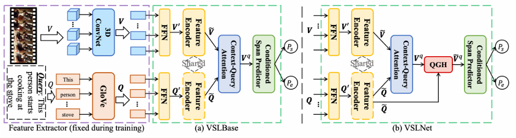

# Natural Language Queries in Egocentric Videos

## **Table of Contents**
- [Project Overview](#project-overview)
- [Methodology](#methodology)
   - [Dataset](#dataset)
- [Models](#models)
   - [VSLNet](#vslnet)
   - [VSLBase](#vslbase)
   - [VSLNet_NonSharedEncoders](#vslnet_nonsharedencoders)
- [Notebooks](#notebooks)
   - [VSLNet, VSLBase, VSLNet_NonSharedEncoders](#vslnet-vslbase-vslnet_nonsharedencoders)
   - [Ego4D_analysis](#comprehensive-analysis)
   - [Query Selection](#query-selection)
   - [Clip Extraction](#clip-extraction)
   - [Predictions](#predictions)
   - [Predictions evaluation](#predictions-evaluation)
- [References](#references)

## **Project Overview**

  
  

    <em>Figure 1: Frames of egocentric videos taken from the Ego4D dataset <a href="#references">[1]</a>.</em>
     
  

Egocentric Vision captures human interactions from a privileged viewpoint, thanks to cameras mounted directly on the head of the user performing the actions. The release of large-scale datasets, such as EPIC-KITCHENS [[2]](#references) and Ego4D [[1]](#references), has encouraged the research community to explore different opportunities for learning from egocentric videos, from the more traditional action recognition and anticipation tasks, to the use of natural language queries for video understanding.
A typical way for humans to understand what is happening in a video is to ask themselves questions under the form of natural language queries, like "Where was object <x> last seen?" or "Which objects did the user interact with?". Thus, the goal becomes to identify the segment of the video that allows the query to be answered. The use of natural language allows greater flexibility in the kinds of queries that can be made.

  
  

    <em>Figure 2: An example of a query on the content of the video, expressed in natural language.</em>
     
  

## **Methodology**
### Dataset :
**• Ego4D** [[1]](#references): 3,000+ hours of egocentric video data.

**• EPIC-KITCHENS** [[2]](#references): Annotated kitchen activity videos.

## **Models**

The "models" directory contains 3 subdirectories dedicated to the VSLNet model and its two variants: VSLBase and VSLNet with non shared encoders.

  
  

      <em>Figure 3: Architecture of the VSLBase and VSLNet models.</em>
     
  

### VSLNet
This repository contains the baseline model [VSLNet][vslnet_baseline] .
For further information on how to properly execute the code, please refer to the [README][vslnet_readme] file contained in the directory.

### VSLBase
The VSLBase model is obtained from the VSLNet baseline by removing the QGH (Query Guided Highlighter) module according its original implementation [[3]](#references) . All the modified code can be found under the tag **"INFO REMOVED"** .

### VSLNet_NonSharedEncoders
This VSLNet implementations exploits two separated Feature Encoders for textual and visual features (instead of a common one as seen in VSLNet baseline). The modified code can be found under the tag **"INFO MODIFIED"** .

## **Notebooks**

This project contains several notebooks for processing the Ego4D dataset and further analysis. Each notebook is designed for a specific task within the pipeline. It is recommended the usage of google colab in order to simplify package installation and to avoid problems arising from different execution environment .

### VSLNet, VSLBase, VSLNet_NonSharedEncoders

**Path :**
Each folder is related to one single model:
- notebooks\VSLBase_TrainAndEval
- notebooks\VSLNet_NonSharedEncoders_TrainAndEval
- notebooks\VSLNet_TrainAndEval

Each folder contains 2 notebooks regarding the training and evaluation process of the above mentioned models.

One notebook exploits **EgoVLP video features** and one notebook exploits **Omnivore video features**. 

The evaluation results are computed in the last cell of the notebooks.

---

### **Comprehensive Analysis**

**Path:**
/notebooks/Ego4D_analysis.ipynb

**Purpose:**
- Provides an in-depth analysis of the Ego4D NLQ annotations, exploring patterns, distributions, and relationships in the dataset.

**Key Features:**

1. **Setup and Data Loading:**
   - Loads annotation and metadata files.
   - Structures annotations into a DataFrame for analysis.

2. **Exploratory Data Analysis (EDA):**
   - Visualizes key metrics like segment durations, template distributions, and common queries.
   - Examines temporal patterns of annotations within videos.

3. **Advanced Analysis:**
   - **Template-Query Correlation:** Analyzes query diversity across templates.
   - **Temporal Clustering:** Identifies density peaks in query positions within video timelines.
   - **Slot and Verb Analysis:** Highlights frequently occurring objects and actions.

**Visualizations:**
- Histogram of segment durations.
- Distribution of query templates.
- Scatter plot of segment duration vs. relative video position.
- KDE plot of query positions.

**Output:**
- Insights into dataset patterns and potential biases for further processing.

---

### **Query Selection**

**Path:**
/notebooks/Query_selection.ipynb

**Purpose:** 
- Selects the top 50 video queries predicted using VSLNet model with non-shared Encoder from the Ego4D dataset based on Intersection over Union (IoU) scores between model predictions and ground truth annotations.

**Key Features:**
1. **Mapping Predictions to Video IDs:**
   - Matches `clip_uid` from the predictions with corresponding `video_uid` using the ground truth annotations.
   - Fixes errors in ground truth timestamps (e.g., negative values close to 0).

2. **Evaluate Predictions:**
   - Computes IoU for each query and ranks the predictions.
   - Evaluates performance using metrics like mean IoU and Recall@K (e.g., Recall@1, Recall@5).

3. **Select Top 50 Queries:**
   - Outputs the top 50 queries with the highest IoU scores.
   - Saves the results in `data/top_50_queries/top_queries.json`.

4. **Visualization:**
   - Plots the IoU distribution and query rankings for better understanding of model performance.

**Output:**
- A JSON file `top_queries.json` containing the selected queries, each with:
  - `video_id`
  - `clip_uid`
  - `query`
  - `ground_truth`
  - `IoU score`

---

### **Clip Extraction**

**Path:**
/notebooks/Clip_extraction.ipynb

**Purpose:**
- Extracts specific video clips corresponding to the top 50 queries from the Ego4D dataset using ground truth intervals.

**Key Features:**
1. **AWS Environment Setup:**
   - Configures AWS CLI for accessing the Ego4D dataset hosted on S3.

2. **Download Manifest:**
   - Retrieves `manifest.csv`, which maps `video_id` to their respective S3 paths.

3. **Process Queries:**
   - Iterates over the top 50 queries from `top_queries.json`.
   - Downloads the corresponding videos and extracts clips using FFmpeg.

4. **Clip Storage:**
   - Saves extracted clips in `/content/extracted_clips`.
   - Compresses the folder into `/content/extracted_clips.zip` for easy download.

**Output:**
- Extracted clips saved in a compressed zip file for further analysis.

---

### **Predictions**

**Path :** notebooks\Predictions\ **LongVU_predictions.ipynb**

This notebook implements the LongVU model [[5]](#references) (specifically the LongVU_Qwen2_7B version) for video understanding. At its core, it loads a specialized AI model designed to process videos and creates predictions based on their content. The notebook sets up the environment, loads the necessary model components, and includes a function called *infer_video* that processes video clips frame by frame. The code is structured to analyze multiple video clips from a directory and generate predictions based on specific queries about the video content.

**Path :** notebooks\Predictions\ **VideoLlava_predictions.ipynb**

This notebook implements the Video-LLaVA-7B model , a video understanding model [[4]](#references). The notebook includes functionality to process videos and can generate responses in different formats, offering two distinct prompting styles: a "user_assistant" format and a "raw" format. It's set up to process the same videos with different parameter configurations, specifically testing different maximum token lengths (20 and 1024 tokens) for the responses.

---

### **Predictions evaluation**

**Path :** notebooks\Predictions evaluation\ **Evaluation_metrics.ipynb**

This notebook implements three metrics used to evaluate previously generated predictions:

**BLEU (Bilingual Evaluation Understudy)** works by comparing sequences of words (called n-grams) between the model's prediction and one or more reference texts. For example, if we have the prediction "The cat sat on the mat" and the reference "A cat is sitting on the mat", BLEU would look at how many word sequences match, considering groups of 1, 2, 3, and 4 words. It's particularly good at detecting when word order and phrasing match closely, but can be quite strict since it requires exact matches.

**ROUGE (Recall-Oriented Understudy for Gisting Evaluation)** takes a different approach by focusing on recall - how much of the important information from the reference text appears in the prediction. It comes in several variants: **ROUGE-1** looks at individual word matches, **ROUGE-2** examines two-word sequences, and **ROUGE-L** finds the longest common subsequence of words. So, ROUGE checks whether the key pieces of information are present, even if they might appear in a slightly different order or phrasing. 

**METEOR (Metric for Evaluation of Translation with Explicit ORdering)** is perhaps the most sophisticated of the three, as it understands that different words can mean the same thing. Unlike BLEU and ROUGE, which require exact word matches, METEOR can recognize synonyms (like "quick" and "fast") and variations of words (like "run" and "running"). It also considers word order and gives partial credit for phrases that are similar but not identical. This makes METEOR especially good at catching when responses are semantically correct even if they use different vocabulary than the reference.

**Path :** notebooks\Predictions evaluation\ **eval_video_qa.py**

This script takes a different approach by using GPT-4 as an automated evaluator (you can find the original script in the official repository of [VideoLLaVa][gpt-evaluator]):
- Takes model predictions and ground truth answers
- Sends them to GPT-4 to evaluate correctness
- Has GPT-4 provide both a yes/no assessment and a score from 0-5
- Calculates overall accuracy and average scores
- Can process multiple evaluations in parallel for efficiency

## References
[1] Grauman, Kristen, et al. "Ego4d: Around the world in 3,000 hours of egocentric video." Proceedings of the IEEE/CVF Conference on Computer Vision and Pattern Recognition. 2022.

[2] Damen, Dima, et al. "Rescaling egocentric vision: Collection, pipeline and challenges for epic-kitchens-100." International Journal of Computer Vision (2022): 1-23.

[3] Zhang, Hao, et al. "Span-based Localizing Network for Natural Language Video Localization."
 Proceedings of the 58th Annual Meeting of the Association for Computational Linguistics.
 2020.

 [4] Lin, B., Ye, Y., Zhu, B., Cui, J., Ning, M., Jin, P., & Yuan, L. (2024). Video-LLaVA: Learning United Visual Representation by Alignment Before Projection. arXiv:2311.10122.

 [5] Shen, X., Xiong, Y., Zhao, C., Wu, L., Chen, J., Zhu, C., Liu, Z., Xiao, F., Varadarajan, B., Bordes, F., Liu, Z., Xu, H., Kim, H. J., Soran, B., Krishnamoorthi, R., Elhoseiny, M., & Chandra, V. (2024). LongVU: Spatiotemporal Adaptive Compression for Long Video-Language Understanding. arXiv:2410.17434.

[vslnet_baseline]: https://github.com/EGO4D/episodic-memory/tree/main/NLQ/VSLNet
[vslnet_readme]: models\VSLNet\README.md
[gpt-evaluator]: https://github.com/PKU-YuanGroup/Video-LLaVA/blob/main/videollava/eval/video/eval_video_qa.py

